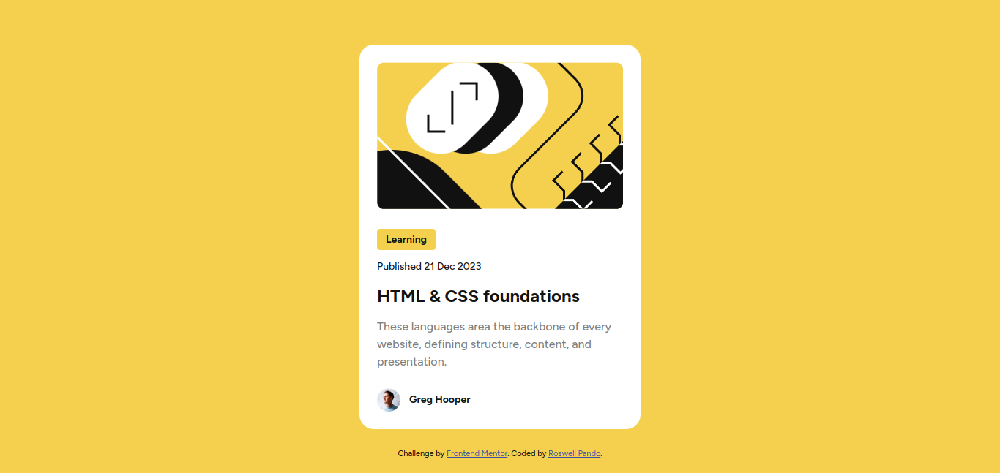

# Frontend Mentor - Blog preview card solution

This is a solution to the [QR code component challenge on Frontend Mentor](https://www.frontendmentor.io/challenges/blog-preview-card-ckPaj01IcS). Frontend Mentor challenges help you improve your coding skills by building realistic projects. 

## Table of contents

- [Overview](#overview)
  - [Screenshot](#screenshot)
  - [Links](#links)
- [My process](#my-process)
  - [Built with](#built-with)
  - [What I learned](#what-i-learned)
  - [Continued development](#continued-development)
  - [Useful resources](#useful-resources)
- [Author](#author)
- [Acknowledgments](#acknowledgments)

## Overview

### Screenshot



### Links

- Solution URL: [GitHub repository](https://github.com/welpmoz/Blog-Preview-Card). Please check the branch `enhanced-code`
- Live Site URL: [Live site](https://welpmoz.github.io/Blog-Preview-Card/)

## My process

### Built with

- Semantic HTML5 markup
- CSS custom properties
- CSS grid
- Class based CSS styles

### What I learned

I'm using CSS grid in these project. Firstly, in my CSS file I puted the next code:

```css
body {
    min-height: 100vh;
    display: grid;
    justify-content: center;
    align-content: center;
    background-color: var(--yellow);
    position: relative;
    grid-template-columns: repeat(4, 7.2rem);
    gap: 3.2rem;
    /* margin: 2.4rem; */
}

@media (min-width: 625px) {
    body {
        grid-template-columns: repeat(6, 7.2rem);
    }

    .card {
        grid-column: 2 / 6;
    }
}

@media (min-width: 895px) {
    body {
        grid-template-columns: repeat(8, 7.2rem);
    }

    .card {
        grid-column: 3 / 7;
    }
}

@media (min-width: 1250px) {
    body {
        grid-template-columns: repeat(12, 7.2rem);
    }

    .card {
        grid-column: 5 / 9;
    }
}
```

But I realized these project no need the use of CSS grid for every breakpoint and the next code 'adapts' very well the page for all screens.

```css
body {
    min-height: 100vh;
    display: grid;
    justify-content: center;
    align-content: center;
    background-color: var(--yellow);
    position: relative;
    grid-template-columns: repeat(4, 7.2rem);
    gap: 3.2rem;
    /* margin: 2.4rem; */
}
```


## Author

- Github - [Roswell Jaime](https://github.com/welpmoz)
- Frontend Mentor - [@welpmoz](https://www.frontendmentor.io/profile/welpmoz)

## Acknowledgments

I greatly appreciate the work done by the Frontend Mentor community. Their challenges are diverse and well-suited for developers at all levels. Additionally, I'm grateful for the inclusion of Figma as a useful resource.